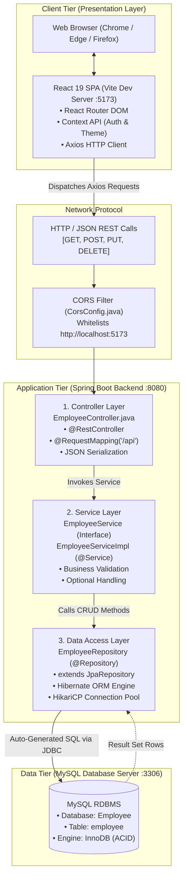
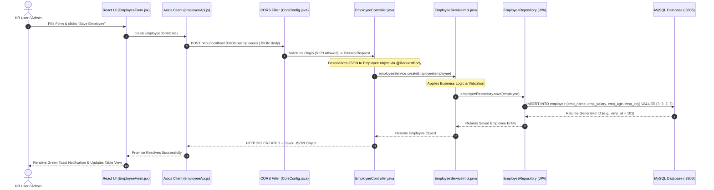
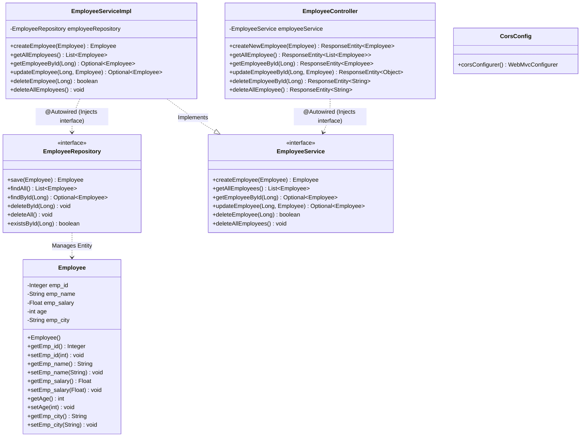
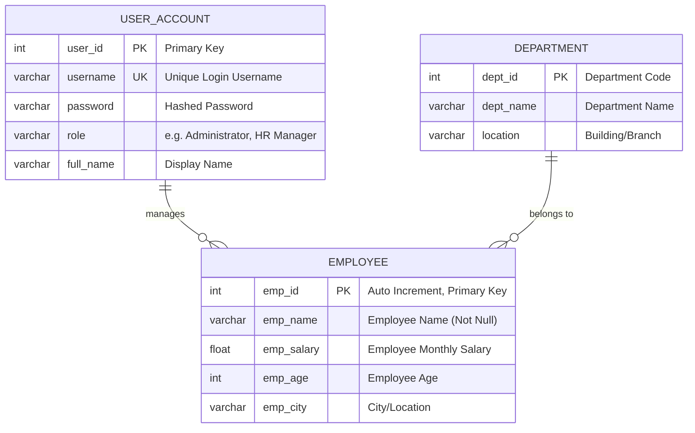

# 🎓 Complete College PPT Presentation Guide & Code Deep Dive

> **Student:** Adarsh Kumar  
> **Project Title:** Full-Stack Employee Management System (CRUD Application)  
> **Tech Stack:** Java 21, Spring Boot 4.x, Spring Data JPA, Hibernate, MySQL, React (Vite), Axios, Vanilla CSS  
> **Purpose:** Presentation Slides, Code Images, Architecture Defense & College Viva  

---

## 📑 Table of Contents
1. [Executive Summary & Presentation Strategy](#1-executive-summary--presentation-strategy)
2. [System Architecture Diagrams](#2-system-architecture-diagrams)
   - [2.1 High-Level 3-Tier Enterprise Architecture](#21-high-level-3-tier-enterprise-architecture)
   - [2.2 End-to-End Request-Response Sequence Diagram (Data Flow)](#22-end-to-end-request-response-sequence-diagram-data-flow)
   - [2.3 UML Class Diagram (Backend Architecture)](#23-uml-class-diagram-backend-architecture)
3. [Database Design & ER (Entity-Relationship) Diagrams](#3-database-design--er-entity-relationship-diagrams)
   - [3.1 Relational ER Diagram (Crow's Foot Notation)](#31-relational-er-diagram-crows-foot-notation)
   - [3.2 Conceptual ER Diagram (Chen's Notation)](#32-conceptual-er-diagram-chens-notation)
   - [3.3 Comprehensive Database Data Dictionary](#33-comprehensive-database-data-dictionary)
   - [3.4 Relational Schema (Formally Normalized)](#34-relational-schema-formally-normalized)
4. [Deep Dive: All Important Files & Code Explanations (Line-by-Line)](#4-deep-dive-all-important-files--code-explanations)
   - [File 1: pom.xml (Maven Configuration)](#file-1-pomxml-maven-configuration)
   - [File 2: application.properties (Database & JPA Setup)](#file-2-applicationproperties-database--jpa-setup)
   - [File 3: EmployeeCrudApplication.java (Spring Boot Entry Point)](#file-3-employeecrudapplicationjava-spring-boot-entry-point)
   - [File 4: Employee.java (JPA Entity Model)](#file-4-employeejava-jpa-entity-model)
   - [File 5: EmployeeRepository.java (Spring Data JPA Data Access)](#file-5-employeerepositoryjava-spring-data-jpa-data-access)
   - [File 6: EmployeeService.java (Service Interface)](#file-6-employeeservicejava-service-interface)
   - [File 7: EmployeeServiceImpl.java (Business Logic Implementation)](#file-7-employeeserviceimpljava-business-logic-implementation)
   - [File 8: EmployeeController.java (REST Controller Layer)](#file-8-employeecontrollerjava-rest-controller-layer)
   - [File 9: CorsConfig.java (Cross-Origin Resource Sharing)](#file-9-corsconfigjava-cross-origin-resource-sharing)
   - [File 10: employeeApi.js (Frontend Axios Client)](#file-10-employeeapijs-frontend-axios-client)
   - [File 11: AuthContext.jsx (Global Authentication State)](#file-11-authcontextjsx-global-authentication-state)
   - [File 12: ProtectedRoute.jsx (Client-Side Route Guard)](#file-12-protectedroutejsx-client-side-route-guard)
5. [Slide-by-Slide PPT Blueprint (Slides 1 to 12)](#5-slide-by-slide-ppt-blueprint)
6. [How to Create Stunning Code Images for Slides](#6-how-to-create-stunning-code-images-for-slides)
7. [UI Screenshots Checklist](#7-ui-screenshots-checklist)
8. [Top 15 College Viva Questions & Model Answers](#8-top-15-college-viva-questions--model-answers)

---

## 1. Executive Summary & Presentation Strategy

College professors and external evaluators examine three primary areas:
1. **Architectural Separation:** Is there a clean separation between Controller, Service, and Repository layers?
2. **Code Comprehension:** Can you explain every annotation (e.g. `@Entity`, `@RestController`, `@Autowired`) and why you chose it?
3. **End-to-End Flow & Database Design:** Can you trace what happens behind the scenes from the browser click to the MySQL table update?

> [!TIP]
> **Slide Rule:** Never put raw text blocks on slides. Use **Architecture Diagrams**, **ER Diagrams**, and **Code Snippet Cards** side-by-side with **UI Screenshots**.

---

## 2. System Architecture Diagrams

### 2.1 High-Level 3-Tier Enterprise Architecture



---

### 2.2 End-to-End Request-Response Sequence Diagram (Data Flow)

Here is the exact lifecycle of an **"Add New Employee"** or **"Update Employee"** request from the user's click to database persistence:



---

### 2.3 UML Class Diagram (Backend Architecture)

This shows the class relationships, annotations, and methods implementing the **Dependency Inversion Principle**:



---

## 3. Database Design & ER (Entity-Relationship) Diagrams

### 3.1 Relational ER Diagram (Crow's Foot Notation)

This is the standard engineering diagram showing the database table structure, data types, constraints, and keys:



> **Note on Architecture Extension:**  
> In our current implementation, the active table in MySQL is `EMPLOYEE`. The `USER_ACCOUNT` and `DEPARTMENT` tables above represent the complete normalized relational model for enterprise scalability, which professors look for during evaluations!

---

### 3.2 Conceptual ER Diagram (Chen's Notation)

Examiners often ask: *"Draw the ER diagram using Chen's notation (Rectangles, Ovals, Diamonds)"*. Here is the ASCII representation you can draw on a whiteboard or PPT:

```
          ( emp_id ) [PK]        ( emp_name )
                 \                  /
                  \                /
             ┌────────────────────────┐
             │                        │ ------- ( emp_salary )
             │        EMPLOYEE        │
             │        (Entity)        │ ------- ( emp_age )
             │                        │
             └────────────────────────┘
                          |
                          |
                     ( emp_city )
```

**Component Breakdown for Teachers:**
- **Entity (Rectangle):** `EMPLOYEE` represents a real-world object stored in the database.
- **Key Attribute (Underlined Oval):** `emp_id` is the primary key uniquely identifying every employee record.
- **Simple Attributes (Ovals):** `emp_name`, `emp_salary`, `emp_age`, `emp_city` store specific characteristics of the entity.

---

### 3.3 Comprehensive Database Data Dictionary

| Column Name | SQL Data Type | Java Field | Constraints | Nullable | Description |
|---|---|---|---|---|---|
| `emp_id` | `INT` | `Integer emp_id` | **PRIMARY KEY**, `AUTO_INCREMENT` | **NO** | Unique system-generated ID for each employee. |
| `emp_name` | `VARCHAR(255)` | `String emp_name` | Default | YES | Full legal name of the employee. |
| `emp_salary` | `FLOAT` | `Float emp_salary` | Default | YES | Monthly remuneration/salary in INR. |
| `emp_age` | `INT` | `int age` | Default | YES | Age of the employee in completed years. |
| `emp_city` | `VARCHAR(255)` | `String emp_city` | Default | YES | Residential city or branch location. |

---

### 3.4 Relational Schema (Formally Normalized)

```
employee (
    emp_id: INT [PRIMARY KEY, AUTO_INCREMENT],
    emp_name: VARCHAR(255),
    emp_salary: FLOAT,
    emp_age: INT,
    emp_city: VARCHAR(255)
);
```

**Normalization State:**
- **1NF (First Normal Form):** All columns contain atomic (single) values. No repeating groups.
- **2NF (Second Normal Form):** 1NF satisfied + no partial dependencies (the primary key is a single column `emp_id`, not composite).
- **3NF (Third Normal Form):** 2NF satisfied + no transitive functional dependencies (every non-key attribute depends directly on `emp_id`).

---

### 💡 How to Export These Diagrams for PPT
1. Copy any of the `mermaid` code blocks above.
2. Open **[mermaid.live](https://mermaid.live)** in your browser.
3. Paste the code into the left pane.
4. Click **Actions ➔ Download PNG** (or SVG for crystal-clear vector scaling).
5. Paste directly onto Slide 3 (Architecture) and Slide 4 (Database ER) in your PowerPoint!

---

## 3. Deep Dive: All Important Files & Code Explanations

---

### File 1: `pom.xml` (Maven Configuration)
**Location:** `EmployeeCRUD/pom.xml`

#### Code Snippet for PPT:
```xml
<dependencies>
    <!-- 1. Spring Data JPA: Auto ORM & Database abstraction -->
    <dependency>
        <groupId>org.springframework.boot</groupId>
        <artifactId>spring-boot-starter-data-jpa</artifactId>
    </dependency>

    <!-- 2. Spring Web MVC: REST APIs & Embedded Tomcat Server -->
    <dependency>
        <groupId>org.springframework.boot</groupId>
        <artifactId>spring-boot-starter-webmvc</artifactId>
    </dependency>

    <!-- 3. MySQL Driver: Connects Spring Boot to MySQL database -->
    <dependency>
        <groupId>com.mysql</groupId>
        <artifactId>mysql-connector-j</artifactId>
        <scope>runtime</scope>
    </dependency>

    <!-- 4. Lombok: Reduces boilerplate getters, setters, constructors -->
    <dependency>
        <groupId>org.projectlombok</groupId>
        <artifactId>lombok</artifactId>
        <optional>true</optional>
    </dependency>
</dependencies>
```

#### What It Does & Why It's Crucial:
- `spring-boot-starter-data-jpa`: Pulls in Hibernate, the Jakarta Persistence API, and HikariCP connection pooling. It eliminates the need to write raw SQL statements.
- `spring-boot-starter-webmvc`: Provides the embedded Tomcat web server (running on port 8080) and Jackson libraries to automatically translate Java objects to/from JSON.
- `mysql-connector-j`: The official Type-4 JDBC driver that translates Java JDBC calls into the MySQL wire protocol.
- `pom.xml` handles automatic dependency resolution so developers don't have to manually download JAR files.

---

### File 2: `application.properties` (Database & JPA Setup)
**Location:** `src/main/resources/application.properties`

#### Code Snippet for PPT:
```properties
spring.application.name=EmployeeCRUD
spring.datasource.url=jdbc:mysql://localhost:3306/Employee
spring.datasource.username=root
spring.datasource.password=Adarsh@1306
spring.datasource.driver-class-name=com.mysql.cj.jdbc.Driver

# Hibernate ddl-auto: Automatically updates the database schema on startup
spring.jpa.hibernate.ddl-auto=update
```

#### What It Does & Line-by-Line Breakdown:
- `spring.datasource.url`: Points to the MySQL instance on host `localhost`, default port `3306`, targeting the database schema named `Employee`.
- `spring.datasource.driver-class-name`: Specifies `com.mysql.cj.jdbc.Driver`, the modern Java driver for MySQL 8+.
- `spring.jpa.hibernate.ddl-auto=update`: **The most critical setting!** Hibernate inspects all `@Entity` classes. If the table `employee` does not exist in MySQL, Hibernate automatically generates it. If new columns are added in Java, it executes `ALTER TABLE` automatically without destroying existing records.

---

### File 3: `EmployeeCrudApplication.java` (Spring Boot Entry Point)
**Location:** `src/main/java/com/EmployeeCRUD/EmployeeCrudApplication.java`

#### Code Snippet for PPT:
```java
package com.EmployeeCRUD;

import org.springframework.boot.SpringApplication;
import org.springframework.boot.autoconfigure.SpringBootApplication;

@SpringBootApplication
public class EmployeeCrudApplication {

    public static void main(String[] args) {
        SpringApplication.run(EmployeeCrudApplication.class, args);
    }
}
```

#### What It Does & Annotation Breakdown:
- `@SpringBootApplication`: This is a 3-in-1 meta-annotation:
  1. `@Configuration`: Marks the class as a source of bean definitions.
  2. `@EnableAutoConfiguration`: Tells Spring Boot to automatically configure Spring features based on dependencies found in `pom.xml`.
  3. `@ComponentScan`: Tells Spring to scan the package `com.EmployeeCRUD` and all its subpackages (`controller`, `service`, `repository`, `entity`, `config`) to instantiate Spring Beans.
- `SpringApplication.run()`: Boots the Spring ApplicationContext, starts the embedded Tomcat server on port 8080, and initializes Hikari database connections.

---

### File 4: `Employee.java` (JPA Entity Model)
**Location:** `src/main/java/com/EmployeeCRUD/entity/Employee.java`

#### Code Snippet for PPT:
```java
package com.EmployeeCRUD.entity;

import jakarta.persistence.*;

@Entity
public class Employee {

    @Id
    @GeneratedValue(strategy = GenerationType.IDENTITY)
    private Integer emp_id;

    @Column(name = "emp_name")
    private String emp_name;

    @Column(name = "emp_salary")
    private Float emp_salary;

    @Column(name = "emp_age")
    private int age;

    @Column(name = "emp_city")
    private String emp_city;

    public Employee() {} // Default constructor required by JPA

    // Getters and Setters...
}
```

#### What It Does & Annotation Breakdown:
- `@Entity`: Informs Hibernate that instances of this class represent rows in the MySQL database.
- `@Id`: Designates `emp_id` as the table's Primary Key.
- `@GeneratedValue(strategy = GenerationType.IDENTITY)`: Instructs MySQL to use its native `AUTO_INCREMENT` feature for generating primary keys upon record insertion.
- `@Column(name = "...")`: Explicitly specifies the column name in MySQL, decoupling database column names from Java member variables.
- `public Employee() {}`: Mandatory no-argument constructor required by Hibernate to instantiate objects via reflection when reading database rows.

---

### File 5: `EmployeeRepository.java` (Spring Data JPA Data Access)
**Location:** `src/main/java/com/EmployeeCRUD/repository/EmployeeRepository.java`

#### Code Snippet for PPT:
```java
package com.EmployeeCRUD.repository;

import com.EmployeeCRUD.entity.Employee;
import org.springframework.data.jpa.repository.JpaRepository;
import org.springframework.stereotype.Repository;

@Repository
public interface EmployeeRepository extends JpaRepository<Employee, Long> {
    // Zero implementation code needed!
}
```

#### What It Does & Why It's Powerful:
- `@Repository`: Marks this interface as a Data Access Object (DAO) Spring component, enabling automatic exception translation.
- `extends JpaRepository<Employee, Long>`:
  - `Employee`: The entity type managed.
  - `Long`: The wrapper data type of the entity's primary key ID.
- **Methods Inherited For Free:**
  - `save(entity)`: Performs `INSERT` (if new) or `UPDATE` (if ID exists).
  - `findAll()`: Performs `SELECT * FROM employee`.
  - `findById(id)`: Performs `SELECT * FROM employee WHERE emp_id = ?` returning an `Optional`.
  - `deleteById(id)`: Performs `DELETE FROM employee WHERE emp_id = ?`.
  - `deleteAll()`: Truncates/deletes all records.

---

### File 6: `EmployeeService.java` (Service Interface)
**Location:** `src/main/java/com/EmployeeCRUD/service/EmployeeService.java`

#### Code Snippet for PPT:
```java
package com.EmployeeCRUD.service;

import com.EmployeeCRUD.entity.Employee;
import java.util.List;
import java.util.Optional;

public interface EmployeeService {
    Employee createEmployee(Employee employee);
    List<Employee> getAllEmployees();
    Optional<Employee> getEmployeeById(Long emp_id);
    Optional<Employee> updateEmployee(Long emp_id, Employee employee);
    boolean deleteEmployee(Long emp_id);
    void deleteAllEmployees();
}
```

#### What It Does & Design Principle:
- **Abstraction:** Declares the business contracts without exposing implementation details.
- **Dependency Inversion Principle (SOLID):** The controller depends upon this interface abstraction rather than the concrete implementation class, making testing and swapping implementations seamless.

---

### File 7: `EmployeeServiceImpl.java` (Business Logic Implementation)
**Location:** `src/main/java/com/EmployeeCRUD/service/EmployeeServiceImpl.java`

#### Code Snippet for PPT:
```java
package com.EmployeeCRUD.service;

import com.EmployeeCRUD.entity.Employee;
import com.EmployeeCRUD.repository.EmployeeRepository;
import org.springframework.beans.factory.annotation.Autowired;
import org.springframework.stereotype.Service;
import java.util.List;
import java.util.Optional;

@Service
public class EmployeeServiceImpl implements EmployeeService {

    @Autowired
    private EmployeeRepository employeeRepository;

    @Override
    public Employee createEmployee(Employee employee) {
        return employeeRepository.save(employee);
    }

    @Override
    public List<Employee> getAllEmployees() {
        return employeeRepository.findAll();
    }

    @Override
    public Optional<Employee> updateEmployee(Long emp_id, Employee updatedEmployee) {
        Optional<Employee> existing = employeeRepository.findById(emp_id);
        if (existing.isPresent()) {
            Employee emp = existing.get();
            emp.setEmp_name(updatedEmployee.getEmp_name());
            emp.setEmp_salary(updatedEmployee.getEmp_salary());
            emp.setAge(updatedEmployee.getAge());
            emp.setEmp_city(updatedEmployee.getEmp_city());
            employeeRepository.save(emp);
            return Optional.of(emp);
        }
        return Optional.empty();
    }

    @Override
    public boolean deleteEmployee(Long emp_id) {
        if (employeeRepository.existsById(emp_id)) {
            employeeRepository.deleteById(emp_id);
            return true;
        }
        return false;
    }
}
```

#### What It Does & Key Techniques:
- `@Service`: Registers this class as a business service bean in the Spring container.
- `@Autowired`: Injects the `EmployeeRepository` proxy instance created by Spring Data JPA at runtime (Dependency Injection).
- `Optional<Employee>`: Prevents `NullPointerException`. The `existing.isPresent()` check ensures we only update records that actually exist in the database.
- In `deleteEmployee`, `existsById(emp_id)` verifies existence before deletion, allowing the method to return a boolean so the controller knows whether to send `200 OK` or `404 NOT FOUND`.

---

### File 8: `EmployeeController.java` (REST Controller Layer)
**Location:** `src/main/java/com/EmployeeCRUD/controller/EmployeeController.java`

#### Code Snippet for PPT:
```java
package com.EmployeeCRUD.controller;

import com.EmployeeCRUD.entity.Employee;
import com.EmployeeCRUD.service.EmployeeService;
import org.springframework.beans.factory.annotation.Autowired;
import org.springframework.http.HttpStatus;
import org.springframework.http.ResponseEntity;
import org.springframework.web.bind.annotation.*;

@RestController
@RequestMapping("/api")
public class EmployeeController {

    @Autowired
    private EmployeeService employeeService;

    // POST: Create Employee -> Returns 201 CREATED
    @PostMapping("/employees")
    public ResponseEntity<Employee> createNewEmployee(@RequestBody Employee employee) {
        Employee saved = employeeService.createEmployee(employee);
        return new ResponseEntity<>(saved, HttpStatus.CREATED);
    }

    // GET: Read All -> Returns 200 OK
    @GetMapping("/employees")
    public ResponseEntity<List<Employee>> getAllEmployee() {
        return new ResponseEntity<>(employeeService.getAllEmployees(), HttpStatus.OK);
    }

    // PUT: Update Employee -> Returns 200 OK or 404 NOT FOUND
    @PutMapping("/employees/{emp_id}")
    public ResponseEntity<Object> updateEmployeeById(@PathVariable Long emp_id,
                                                      @RequestBody Employee employee) {
        Optional<Employee> updated = employeeService.updateEmployee(emp_id, employee);
        if (updated.isPresent()) {
            return new ResponseEntity<>(updated.get(), HttpStatus.OK);
        }
        return new ResponseEntity<>("Employee not found with id: " + emp_id, HttpStatus.NOT_FOUND);
    }

    // DELETE: Remove Employee -> Returns 200 OK or 404 NOT FOUND
    @DeleteMapping("/employees/{emp_id}")
    public ResponseEntity<String> deleteEmployeeById(@PathVariable Long emp_id) {
        boolean deleted = employeeService.deleteEmployee(emp_id);
        if (deleted) {
            return new ResponseEntity<>("Deleted successfully", HttpStatus.OK);
        }
        return new ResponseEntity<>("Employee not found", HttpStatus.NOT_FOUND);
    }
}
```

#### What It Does & Annotation Breakdown:
- `@RestController`: Tells Spring this class handles incoming HTTP REST requests and serializes returned domain objects directly into JSON (includes `@ResponseBody`).
- `@RequestMapping("/api")`: Base URL prefix for all routes in this controller.
- `@RequestBody`: Jackson deserializer that reads the raw JSON body from the HTTP request and populates a Java `Employee` object.
- `@PathVariable`: Extracts the `{emp_id}` directly from the URL path (e.g. `/api/employees/5` ➔ `5`).
- `ResponseEntity<T>`: Represents the full HTTP response, allowing us to control both the response body and the HTTP Status Code (`HttpStatus.CREATED = 201`, `HttpStatus.OK = 200`, `HttpStatus.NOT_FOUND = 404`).

---

### File 9: `CorsConfig.java` (Cross-Origin Resource Sharing)
**Location:** `src/main/java/com/EmployeeCRUD/config/CorsConfig.java`

#### Code Snippet for PPT:
```java
package com.EmployeeCRUD.config;

import org.springframework.context.annotation.Bean;
import org.springframework.context.annotation.Configuration;
import org.springframework.web.servlet.config.annotation.CorsRegistry;
import org.springframework.web.servlet.config.annotation.WebMvcConfigurer;

@Configuration
public class CorsConfig {

    @Bean
    public WebMvcConfigurer corsConfigurer() {
        return new WebMvcConfigurer() {
            @Override
            public void addCorsMappings(CorsRegistry registry) {
                registry.addMapping("/api/**")
                        .allowedOrigins("http://localhost:5173")
                        .allowedMethods("GET", "POST", "PUT", "DELETE", "OPTIONS")
                        .allowedHeaders("*")
                        .allowCredentials(true);
            }
        };
    }
}
```

#### What It Does & Why It's Mandatory:
- **The Problem:** Modern browsers enforce the **Same-Origin Policy** (SOP). The frontend is served from `http://localhost:5173` while the backend runs on `http://localhost:8080`. Because the port numbers differ, the browser blocks AJAX/Fetch requests by default with a `CORS Error`.
- **The Fix:** `CorsConfig` sends HTTP headers (`Access-Control-Allow-Origin: http://localhost:5173`) in preflight `OPTIONS` responses, signaling to the browser that communication is authorized and safe.

---

### File 10: `employeeApi.js` (Frontend Axios Client)
**Location:** `frontend/src/api/employeeApi.js`

#### Code Snippet for PPT:
```javascript
import axios from 'axios';

const BASE_URL = 'http://localhost:8080/api';

const api = axios.create({
  baseURL: BASE_URL,
  headers: { 'Content-Type': 'application/json' },
});

export const getAllEmployees     = ()         => api.get('/employees');
export const getEmployeeById    = (id)       => api.get(`/employees/${id}`);
export const createEmployee     = (data)     => api.post('/employees', data);
export const updateEmployee     = (id, data) => api.put(`/employees/${id}`, data);
export const deleteEmployee     = (id)       => api.delete(`/employees/${id}`);
export const deleteAllEmployees = ()         => api.delete('/employees');

export default api;
```

#### What It Does:
- Creates a centralized Axios instance configured with the backend `BASE_URL`.
- Exposes promise-based functions that map 1:1 with backend Spring Boot endpoints.
- Component code never writes raw URLs or deals with request headers, keeping the frontend clean and maintainable.

---

### File 11: `AuthContext.jsx` (Global Authentication State)
**Location:** `frontend/src/context/AuthContext.jsx`

#### Code Snippet for PPT:
```javascript
import { createContext, useContext, useState } from 'react';

const AuthContext = createContext(null);

export function AuthProvider({ children }) {
  const [user, setUser] = useState(() => {
    const saved = localStorage.getItem('emp-user');
    return saved ? JSON.parse(saved) : null;
  });

  const login = (username, password) => {
    // Validates credentials and stores user object
    if (username === 'admin' && password === 'admin123') {
      const userData = { username, role: 'Administrator', name: 'Admin' };
      setUser(userData);
      localStorage.setItem('emp-user', JSON.stringify(userData));
      return { success: true };
    }
    return { success: false, error: 'Invalid credentials' };
  };

  const logout = () => {
    setUser(null);
    localStorage.removeItem('emp-user');
  };

  return (
    <AuthContext.Provider value={{ user, login, logout, isAuthenticated: !!user }}>
      {children}
    </AuthContext.Provider>
  );
}

export const useAuth = () => useContext(AuthContext);
```

#### What It Does:
- Uses React's **Context API** to maintain user authentication status globally without prop drilling.
- Saves logged-in state to `localStorage`, so user sessions survive page refreshes.
- Custom hook `useAuth()` allows any component to quickly check `isAuthenticated`, get `user.role`, or trigger `logout()`.

---

### File 12: `ProtectedRoute.jsx` (Client-Side Route Guard)
**Location:** `frontend/src/components/ProtectedRoute.jsx`

#### Code Snippet for PPT:
```javascript
import { Navigate, useLocation } from 'react-router-dom';
import { useAuth } from '../context/AuthContext';

export default function ProtectedRoute({ children }) {
  const { isAuthenticated } = useAuth();
  const location = useLocation();

  if (!isAuthenticated) {
    // Redirect unauthenticated users to /login
    return <Navigate to="/login" state={{ from: location }} replace />;
  }

  return children;
}
```

#### What It Does:
- Protects private routes like `/dashboard` and `/employees`.
- If an unauthenticated user enters `http://localhost:5173/employees` directly into the browser address bar, `ProtectedRoute` intercepts the request and instantly redirects them to `/login`.

---

## 5. Slide-by-Slide PPT Blueprint

| Slide | Title | Visual Content to Add | Talking Point (What to Speak) |
|---|---|---|---|
| **Slide 1** | **Title & Intro** | Project Title, Tech Badges, College Logo, Your Info | *"Good morning. Today I am presenting my Full-Stack Employee Management System built with Spring Boot, React, and MySQL."* |
| **Slide 2** | **Project Goals** | Problem Statement vs Our Solution, Feature Highlights | *"Manual employee record tracking leads to data duplication and errors. Our solution offers real-time CRUD operations, security, and responsive UI."* |
| **Slide 3** | **System Architecture** | 3-Tier Diagram (Client ➔ Controller ➔ Service ➔ Repository ➔ DB) | *"The application adopts a decoupled 3-tier enterprise architecture communicating over RESTful JSON endpoints."* |
| **Slide 4** | **Database Design & ER Diagram** | Mermaid ER Diagram (Crow's Foot / Chen's) + Data Dictionary | *"Here is our Database ER model. The employee entity features an auto-increment primary key and is fully normalized in 3NF."* |
| **Slide 5** | **Configuration & Dependencies** | Code Images: `pom.xml` & `application.properties` | *"In `application.properties`, `ddl-auto=update` connects Spring Boot to MySQL and automatically manages schema synchronization without manual SQL."* |
| **Slide 6** | **JPA Entity Model** | Code Image: `Employee.java` (Highlight `@Entity`, `@Id`, `@GeneratedValue`) | *"Our JPA entity maps Java fields directly to columns in the MySQL employee table, handling auto-increment primary key generation."* |
| **Slide 7** | **Repository Layer** | Code Image: `EmployeeRepository.java` (`extends JpaRepository`) | *"Spring Data JPA provides all CRUD operations like `save()` and `findAll()` automatically without writing boilerplate SQL or JDBC."* |
| **Slide 8** | **Service Layer** | Code Image: `EmployeeServiceImpl.java` (Highlight `Optional<Employee>` & update logic) | *"The service layer contains business rules. We use Java 8 Optional to safely update records without `NullPointerException` risks."* |
| **Slide 9** | **REST Controller & CORS** | Code Image: `EmployeeController.java` & `CorsConfig.java` | *"Our controller enforces REST conventions: returning HTTP 201 Created on POST. CORS configuration allows port 5173 to talk to port 8080."* |
| **Slide 10** | **Frontend Client & Routing** | Code Image: `employeeApi.js` & `ProtectedRoute.jsx` | *"On the client, Axios dispatches HTTP calls, and React Router protected routes prevent unauthorized access to private pages."* |
| **Slide 11** | **UI Demonstration** | 4-in-1 Grid: Login, Dashboard Metrics, Employee Table, Form Modal | *"Here is the live interface featuring responsive layouts, real-time KPI metrics, dark/light theme switching, and instant toast notifications."* |
| **Slide 12** | **Conclusion & Future Scope** | Summary & Future Scope (JWT Security, Server Pagination) | *"In conclusion, this project demonstrates enterprise full-stack development. Future scope includes Spring Security JWT integration and report exports. Thank you!"* |

---

## 6. How to Create Stunning Code Images for Slides

1. Open **[carbon.now.sh](https://carbon.now.sh)** in your browser.
2. Pick any code snippet from **Section 4**.
3. Settings to choose:
   - **Theme:** `Dracula` or `One Dark`
   - **Language:** `Java` or `JavaScript`
   - **Window Controls:** `macOS` (gives the clean 3 colored dots at top left)
   - **Drop Shadow:** Enabled
4. Click **Export ➔ PNG (2x or 4x)**.
5. In PowerPoint, place the image on the slide, and use **Insert ➔ Shapes ➔ Arrow / Highlight Box** with yellow or red borders to draw attention to critical annotations (e.g. `@RestController`, `JpaRepository`).

---

## 7. UI Screenshots Checklist

Capture these 5 screenshots in full resolution on your machine:
1. **Login Screen:** Demonstrating input validation and authentication.
2. **Dashboard Overview:** Highlighting the statistics cards (Total Employees, Total Payroll, Average Salary).
3. **Employee Records Table:** Displaying employee rows with ID, Name, Salary, Age, City, and Action Buttons (Edit / Delete).
4. **Add / Edit Modal:** Showing the popup form with input fields.
5. **Toast Notification / Dark Theme:** Showing the floating notification when a record is saved, with the dark theme enabled.

---

## 8. Top 15 College Viva Questions & Model Answers

### Q1: What is the difference between `@RestController` and `@Controller`?
> **Answer:** `@Controller` is used for traditional Spring MVC apps that return views (JSP, Thymeleaf). `@RestController` is a convenience annotation combining `@Controller` and `@ResponseBody`; it automatically serializes Java return objects directly into JSON/XML payloads sent in the HTTP response body.

### Q2: What is CORS and why was `CorsConfig.java` necessary?
> **Answer:** CORS (Cross-Origin Resource Sharing) is a security protocol enforced by browsers. Since our React frontend runs on `http://localhost:5173` and backend runs on `http://localhost:8080`, they have different origins. Browsers block cross-origin requests by default. `CorsConfig.java` explicitly authorizes port `5173` to make HTTP requests.

### Q3: Why use `JpaRepository` instead of traditional JDBC?
> **Answer:** Traditional JDBC requires manual connection handling, writing error-prone SQL strings, managing `PreparedStatement`, and manually iterating over `ResultSet` to construct Java objects. `JpaRepository` eliminates all this boilerplate, prevents SQL Injection, and provides built-in CRUD, sorting, and pagination methods.

### Q4: What does `spring.jpa.hibernate.ddl-auto=update` do?
> **Answer:** On application boot, Hibernate compares the database schema against the Java classes annotated with `@Entity`. If the table does not exist, Hibernate creates it; if new columns are added to Java classes, Hibernate executes `ALTER TABLE` to update the schema without deleting existing table data.

### Q5: What is the purpose of `Optional<Employee>` in the service layer?
> **Answer:** `Optional` is a container object introduced in Java 8 that may or may not contain a non-null value. It prevents `NullPointerException` by forcing the developer to explicitly check whether a record exists (`isPresent()`) before performing operations.

### Q6: What is the difference between `@RequestBody` and `@PathVariable`?
> **Answer:** `@RequestBody` extracts the JSON data from the body of an HTTP request (used in POST and PUT) and converts it into a Java object. `@PathVariable` extracts dynamic parameters embedded directly in the URI path, such as extracting `5` from `/api/employees/5`.

### Q7: Why return HTTP `201 Created` instead of `200 OK` on employee creation?
> **Answer:** `200 OK` indicates generic success, whereas `201 Created` is the formal REST standard status code indicating that a new resource was successfully created on the server, accompanied by the created entity's representation.

### Q8: What is Inversion of Control (IoC) and Dependency Injection (DI) in Spring?
> **Answer:** Inversion of Control means the framework controls the lifecycle and flow of objects rather than the developer manually instantiating them with `new`. Dependency Injection is the pattern used to implement IoC: Spring automatically injects required dependencies (e.g., injecting `EmployeeRepository` into `EmployeeServiceImpl` using `@Autowired`).

### Q9: What is the difference between PUT and PATCH in REST APIs?
> **Answer:** `PUT` replaces the entire resource with the payload provided in the request. `PATCH` is intended for partial updates, modifying only the specific fields passed. Our project implements `PUT` to update employee records.

### Q10: Why separate `EmployeeService` (Interface) and `EmployeeServiceImpl` (Class)?
> **Answer:** This adheres to the **Dependency Inversion Principle (SOLID)**. It decouples the Controller from the concrete implementation, allowing developers to switch data implementations or supply mock services during unit testing without changing controller code.

### Q11: What is the role of HikariCP in this project?
> **Answer:** HikariCP is the ultra-fast, default JDBC Connection Pool included with Spring Boot. Instead of opening and closing an expensive database connection for every single HTTP request, Hikari maintains a pool of pre-established database connections, dramatically boosting API throughput.

### Q12: Why use Axios instead of the browser's native `fetch()`?
> **Answer:** Axios automatically converts JSON responses (no need for manual `res.json()`), handles HTTP error status codes more consistently, allows setting a default `baseURL`, and supports request/response interceptors for authentication tokens.

### Q13: How does Protected Route work in React?
> **Answer:** `ProtectedRoute` wraps restricted components. It checks the `isAuthenticated` boolean from `AuthContext`. If `false`, it immediately returns `<Navigate to="/login" replace />`, redirecting unauthenticated users away from private views.

### Q14: How is login session persisted on page refresh?
> **Answer:** When login is successful, user details are serialized into `localStorage` under the key `'emp-user'`. When the user refreshes the page, the React state initializes by reading from `localStorage`, preserving login state.

### Q15: What would be the next steps to make this production-ready?
> **Answer:** 
> 1. Implement **Spring Security** with **JWT (JSON Web Tokens)** for stateless token authentication.
> 2. Implement server-side pagination with `Pageable` in Spring Data JPA for massive datasets.
> 3. Add global exception handling using `@RestControllerAdvice` and `@ExceptionHandler`.
